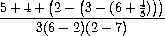

# [SICP](https://mitpress.mit.edu/sites/default/files/sicp/index.html)  

## [Chapter 1](https://mitpress.mit.edu/sites/default/files/sicp/full-text/book/book-Z-H-9.html#%_chap_1)  

### Exercise 1.1  
Below is a sequence of expressions. What is the result printed by the interpreter in response to each expression? Assume that the sequence is to be evaluated in the order in which it is presented:  

``` scheme
10
;; Answer: 10
```
``` scheme
(+ 5 3 4)
;; Answer: 12
```
``` scheme
(- 9 1)
;; Answer: 8
```
``` scheme
(/ 6 2)
;; Answer: 3
```
``` scheme
(+ (* 2 4) (- 4 6))
;; Answer: 6
```
``` scheme
(define a 3)
(define b (+ a 1))

(+ a b (* a b))
;; Answer: 19
```
``` scheme
(define a 3)
(define b (+ a 1))

(= a b)
;; Answer: #f
```
``` scheme
(define a 3)
(define b (+ a 1))

(if (and (> b a) (< b (* a b)))
    b
    a)

;; Answer: 4
```
``` scheme
(define a 3)
(define b (+ a 1))

(cond ((= a 4) 6)
      ((= b 4) (+ 6 7 a))
      (else 25))
;; Answer: 16
```
```scheme
(define a 3)
(define b (+ a 1))

(+ 2 (if (> b a) b a))
;; Answer: 6
```
```scheme
(define a 3)
(define b (+ a 1))

(* (cond ((> a b) a)
         ((< a b) b)
         (else -1))
   (+ a 1))
;; Answer: 16
```
  
### Exercise 1.2  
Translate the following expression into prefix form:   
```scheme
;; Answer
(/ (+ 5 4
        (- 2 
           (- 3 
              (+ 6 
                 (/ 4 5)
              )
           )
        )
   )
   (* 3 
      (- 6 2)
      (- 2 7)
   )
)
```  
### Exercise 1.3  
Define a procedure that takes three numbers as arguments and returns the sum of the squares of the two larger numbers.  
```scheme
;; Answer:
(define (sum_of_squares x y)
    (define (square x) (* x x))
    (+ (square x) (square y))
)

(define (compare x y z op)
    (cond ((and (op x y) (op x z)) x)
          ((and (op y x) (op y z)) y)
          (else z)
    )
)

(define (task3 x y z)
    (define (max x y z) (compare x y z >))
    (define (min x y z) (compare x y z <))
    (define sum (+ x y z))
    (define m (- sum (max x y z)))
    (sum_of_squares (- sum m) (- m (min x y z)))
)

```  
### Exercise 1.4  
Observe that our model of evaluation allows for combinations whose operators are compound expressions. Use this observation to describe the behavior of the following procedure:  
```scheme
(define (a-plus-abs-b a b)
    ((if (> b 0) + -) a b))
```  
Answer:  
Method uses operator according to value of `b`. If `b` greater than `0`, will be used `+` operator for `a` and `b`, otherwise `-` operator.  

### Exercise 1.5  
Ben Bitdiddle has invented a test to determine whether the interpreter he is faced with is using applicative-order evaluation or normal-order evaluation. He defines the following two procedures:  
```scheme
(define (p) (p))

(define (test x y)
  (if (= x 0)
      0
      y))
```  
Then he evaluates the expression  
```scheme
(test 0 (p))
```  
What behavior will Ben observe with an interpreter that uses applicative-order evaluation? What behavior will he observe with an interpreter that uses normal-order evaluation? Explain your answer. (Assume that the evaluation rule for the special form if is the same whether the interpreter is using normal or applicative order: The predicate expression is evaluated first, and the result determines whether to evaluate the consequent or the alternative expression.)  

Answer:  
If interpreter uses **application order evalution** we will see infinite loop, because of all arguments must be evaluated before function call
and we cannot evaluate `y`. To evaluate `y` we must evaluate value of `p`, but `p` defines through `p`.  
If interpreter uses **normal order evaluation**, test will return `0`, because we do not need to evaluate `y` argument.  

### Exercise 1.6  
Alyssa P. Hacker doesn't see why if needs to be provided as a special form. "Why can't I just define it as an ordinary procedure in terms of cond?" she asks. Alyssa's friend Eva Lu Ator claims this can indeed be done, and she defines a new version of if:  

```scheme
(define (new-if predicate then-clause else-clause)
  (cond (predicate then-clause)
        (else else-clause)))
```  

Eva demonstrates the program for Alyssa:  

```scheme
(new-if (= 2 3) 0 5)
5

(new-if (= 1 1) 0 5)
0
```  

Delighted, Alyssa uses new-if to rewrite the square-root program:  

```scheme
(define (sqrt-iter guess x)
  (new-if (good-enough? guess x)
          guess
          (sqrt-iter (improve guess x)
                     x)))
```

What happens when Alyssa attempts to use this to compute square roots? Explain.  
Answer:  
On **application order evalution** we will stuck in infinite loop on calculating `sqrt-iter` when we try to unfold `new-if`.  

### Exercise 1.7  
The `good-enough?` test used in computing square roots will not be very effective for finding the square roots of very small numbers. Also, in real computers, arithmetic operations are almost always performed with limited precision. This makes our test inadequate for very large numbers. Explain these statements, with examples showing how the test fails for small and large numbers. An alternative strategy for `implementing good-enough?` is to watch how guess changes from one iteration to the next and to stop when the change is a very small fraction of the guess. Design a square-root procedure that uses this kind of end test. Does this work better for small and large numbers?  
```scheme
; Answer:
; Trying to find minimum change between guesses with diff

(define (diff_good_enough? guess previous_guess)
  (< (abs (- guess previous_guess)) 0.001)
  )

(define (diff_sqrt_iteration guess previous_guess original)
  (if (diff_good_enough? guess previous_guess)
      guess
      (diff_sqrt_iteration (improve guess original) guess original))
  )

(define (diff_sqrt x)
  (diff_sqrt_iteration 1.0 x x)
  )
```  

### Exercise 1.9  
Each of the following two procedures defines a method for adding two positive integers in terms of the procedures inc, which increments its argument by 1, and dec, which decrements its argument by 1.  
```scheme
(define (+ a b)
  (if (= a 0)
      b
      (inc (+ (dec a) b))))

(define (+ a b)
  (if (= a 0)
      b
      (+ (dec a) (inc b))))
```  
Using the substitution model, illustrate the process generated by each procedure in evaluating `(+ 4 5)`. Are these processes iterative or recursive?  
```scheme
; Answer for first function:
(+ 4 5)
(inc (+ 3 5))
(inc (inc (+ 2 5)))
(inc (inc (inc (+ 1 5))))
(inc (inc (inc (inc (0 5)))))
(inc (inc (inc (inc 5))))
(inc (inc (inc 6)))
(inc (inc 7))
(inc 8)
9
; Function is recursive.

; Answer for second function:
(+ 4 5)
(+ 3 6)
(+ 2 7)
(+ 1 8)
(+ 0 9)
9
; Function is iterative.
```  

### Exercise 1.8  
Newton's method for cube roots is based on the fact that if y is an approximation to the cube root of x, then a better approximation is given by the value:   
Use this formula to implement a cube-root procedure analogous to the square-root procedure.  

```scheme
; Answer:

(define (improve guess original)
  (/ (+ (* guess 2)
        (/ original (square guess)))
     3)
  )

(define (good_enough? guess previous_guess)
  (< (abs (- previous_guess guess))
     0.001)
  )

(define (cube_root_iter guess previous_guess original)
  (if (good_enough? guess previous_guess)
      guess
      (cube_root_iter (improve guess original)
                       guess
                       original))
  )

(define (cube_root x)
  (cube_root_iter 1.0 x x)
  )

```  

### Exercise 1.10  
The following procedure computes a mathematical function called Ackermann's function.  
```scheme
(define (A x y)
  (cond ((= y 0) 0)
        ((= x 0) (* 2 y))
        ((= y 1) 2)
        (else (A (- x 1)
                 (A x (- y 1))))))
```  
What are the values of the following expressions?  
```scheme
(A 1 10)

(A 2 4)

(A 3 3)
```  

Consider the following procedures, where A is the procedure defined above:  
```scheme
(define (f n) (A 0 n))

(define (g n) (A 1 n))

(define (h n) (A 2 n))

(define (k n) (* 5 n n))
```  

Give concise mathematical definitions for the functions computed by the procedures `f`, `g`, and `h` for positive integer values of `n`. For example, `(k n)` computes `5n^2`.  

```scheme
; Answer:
(A 1 10)

(* 2 (A 1 9))
(* 2 (* 2 (A 1 8)))
(* 2 (* 2 (* 2 (A 1 7))))
(* 2 (* 2 (* 2 (* 2 (A 1 6)))))
(* 2 (* 2 (* 2 (* 2 (* 2 (A 1 5))))))
(* 2 (* 2 (* 2 (* 2 (* 2 (* 2 (A 1 4)))))))
(* 2 (* 2 (* 2 (* 2 (* 2 (* 2 (* 2 (A 1 3))))))))
(* 2 (* 2 (* 2 (* 2 (* 2 (* 2 (* 2 (* 2 (A 1 2)))))))))
(* 2 (* 2 (* 2 (* 2 (* 2 (* 2 (* 2 (* 2 (* 2 (A 1 1))))))))))
(* 2 (* 2 (* 2 (* 2 (* 2 (* 2 (* 2 (* 2 (* 2 2)))))))))

1024

;;;
(A 2 4)
(A 1 (A 2 3))
(A 1 (A 1 (A 2 2)))
(A 1 (A 1 (A 1 (A 2 1))))
(A 1 (A 1 (A 1 2)))
(A 1 (A 1 (A 0 (A 1 1))))
(A 1 (A 1 (A 0 2)))
(A 1 (A 1 (* 2 2)))
(A 1 (A 1 4))
(A 1 (A 0 (A 1 3)))
(A 1 (A 0 8))
(A 1 16)

65536

;;;
(A 3 3)
(A 2 (A 3 2))
(A 2 (A 2 (A 3 1)))
(A 2 (A 2 2))
(A 2 (A 1 (A 2 1)))
(A 2 (A 1 2))
(A 2 4)
(A 1 (A 2 3))
(A 1 (A 1 (A 2 2)))
(A 1 (A 1 (A 1 (A 2 1))))
(A 1 (A 1 (A 1 2)))
(A 1 (A 1 4))
(A 1 16)
65536

; mathematical definitions:
(define (f n) (A 0 n)) ; -> 2 * n

(define (g n) (A 1 n)) ; -> 2 ^ n

(define (h n) (A 2 n)) ; -> 2 ^ (2 ^ n)

(define (k n) (* 5 n n)) ; -> 5 * n^2
```